# Git Branch Strategy

📖 **Navigation**: [← README](README.md) | [Quick Start](QUICKSTART.md) | [Setup Guide](docs/SETUP_GUIDE.md) | [Workflow Examples](docs/WORKFLOW_EXAMPLES.md) | **Branch Strategy**

## Current Version

See [VERSION](VERSION) file for the current base version. The CI/CD pipeline automatically calculates build versions based on branch type and commit. See [Automated Versioning](#automated-versioning) below.

---

## 🌳 Branch Hierarchy Overview

**Visual representation of the parallel branching model:**

```mermaid
graph TB
    release["release (Production)<br/>• Live production code<br/>• Tags: v1.0.0, v1.0.1, v2.0.0<br/>• Requires 2 PR approvals"]
    main["main (Staging)<br/>• Production-ready code<br/>• Tags: v1.0.0-beta, v0.2.0-beta<br/>• Requires 1 PR approval"]
    alpha["alpha (Pre-release)<br/>• Optional branch<br/>• Tags: v1.0.0-alpha<br/>• Only for breaking changes"]
    beta["beta (Testing)<br/>• Major version testing<br/>• Created when needed<br/>• Tags: v1.0.0-beta"]
    feature["feature/*<br/>• From main<br/>• MINOR bump"]
    bugfix["bugfix/*<br/>• From main<br/>• PATCH bump"]
    hotfix["hotfix<br/>• From release<br/>• PATCH bump"]
    
    feature -->|PR| main
    bugfix -->|PR| main
    alpha -->|PR| main
    beta -->|PR| main
    main -->|PR| release
    hotfix -->|PR| release
    
    style release fill:#e74c3c,color:#fff
    style main fill:#3498db,color:#fff
    style alpha fill:#9b59b6,color:#fff
    style beta fill:#e67e22,color:#fff
    style feature fill:#2ecc71,color:#fff
    style bugfix fill:#f39c12,color:#fff
    style hotfix fill:#c0392b,color:#fff
```



### Key Principles

- **Parallel Model**: All development branches (alpha, beta, feature/*, bugfix/*) branch FROM `main` and merge TO `main`
- **Exception**: Only `hotfix` branches FROM `release` and merges TO `release`
- **Single Direction**: No cascading merges between development branches

---

## Branch Structure

```
release (production releases)
  ↑
main (production-ready code)
  ↑ ↑ ↑ ↑ ↑
  │ │ │ │ └─ hotfix (from release, PATCH bump)
  │ │ │ └─── bugfix/* (from main, PATCH bump)
  │ │ └───── feature/* (from main, MINOR bump)
  │ └─────── beta (from main, MAJOR bump)
  └───────── alpha (from main, MAJOR bump)

All branches (alpha, beta, feature/*, bugfix/*) branch FROM main and merge TO main.
Only hotfix branches FROM release and merges TO release.
```

---

## Branch Types

### `release`
- **Purpose**: Production releases and tags
- **Protection**: Requires PR approval (2 reviewers), all tests passing
- **Deploy**: Automatic to production, creates version tags
- **Merge from**: `main` and `hotfix` only
- **Merge to**: `main` (sync after release)

### `main`
- **Purpose**: Production-ready code, release candidates
- **Protection**: Requires PR approval (1 reviewer), all tests passing
- **Deploy**: Automatic to staging with beta tags
- **Merge from**: `alpha`, `beta`, `feature/*` or `release` (sync)
- **Merge to**: `release` when ready for production

### `beta`
- **Purpose**: Major release testing and stabilization
- **Protection**: Requires status checks to pass
- **Deploy**: Automatic to beta environment
- **Branch from**: `main` (auto-created after alpha merge)
- **Merge to**: `main` (updates MAJOR bump to X.Y.Z-beta)

### `alpha`
- **Purpose**: Major release development (breaking changes)
- **Protection**: Requires status checks to pass
- **Deploy**: Automatic to development environment
- **Branch from**: `main`
- **Merge to**: `main` (triggers MAJOR bump to X+1.0.0-alpha)

### `feature/*`
- **Naming**: `feature/short-description`
- **Purpose**: New features (MINOR version bump)
- **Base**: Branch from `main`
- **Merge**: PR to `main` (triggers MINOR bump)

### `bugfix/*`
- **Naming**: `bugfix/issue-number-description`
- **Purpose**: Bug fixes (PATCH version bump)
- **Base**: Branch from `main`
- **Merge**: PR to `main` (triggers PATCH bump)

### `hotfix`
- **Naming**: `hotfix` (single branch)
- **Purpose**: Critical production fixes (PATCH version bump)
- **Base**: Branch from `release`
- **Merge**: PR to `release` (triggers PATCH bump, then auto-syncs to `main`)

---

## Release Flows

Here are different release paths and the automated version semantics based on what branch the code is from. The base version comes from the [VERSION](../VERSION) file and the CI/CD pipeline appends appropriate suffixes.

> **Note**: Pushes to `main` and `release` are only allowed during open Pull Requests against or from the branch.

Following **Semantic Versioning 2.0.0**: [https://semver.org/](https://semver.org/)

**Key Point**: The entire versioning process is **100% automated**. Developers never manually update VERSION or create tags - the CI/CD handles everything!

### Automated Versioning

The CI/CD pipeline (`.github/workflows/ci-cd-versioned.yml`) **automatically** calculates versions based on the **source branch** of Pull Requests:

#### Version Bump Logic
- **Major bump**: When `alpha` branch merges to `main` → `vX.Y.Z` becomes `vX+1.0.0-alpha` (automatic tag created)
  - Then create `beta` branch from main for stabilization
  - `beta` → `main` merge adds `-beta` suffix to already-bumped version
- **Minor bump**: When `feature/*` branch merges to `main` → `vX.Y.Z` becomes `vX.Y+1.0-beta` (automatic tag)
- **Patch bump**: When `bugfix/*` merges to `main` or `hotfix` merges to `release` → `vX.Y.Z` becomes `vX.Y.Z+1` (automatic tag)


#### VERSION File Usage
- Located at root: `VERSION` (currently contains `0.1.0`)
- Used as **base version** for all calculations
- **Supports pre-release suffixes**: `-alpha`, `-beta`, `-rc` (e.g., `1.0.0-alpha`, `1.0.0-beta`, `0.1.1-rc.1`)
- **Note**: `-rc` suffix appears during PRs to `release` branch and is temporarily persisted to VERSION during merge, then becomes clean version
- **Automatically updated by CI/CD** after successful merges:
  - `alpha` → `main`: VERSION becomes `X+1.0.0-alpha`
  - `feature/*` → `main`: VERSION becomes `X.Y+1.0-beta`
  - `bugfix/*` → `main`: VERSION becomes `X.Y.Z+1-beta`
  - `hotfix` → `release`: VERSION becomes `X.Y.Z+1-rc.N` then `X.Y.Z+1` (clean)
  - `main` → `release`: VERSION becomes `X.Y.Z-rc.N` then `X.Y.Z` (clean)
- **No manual intervention required** - CI/CD manages VERSION throughout entire release lifecycle
- CI/CD strips suffixes, calculates bumps from base X.Y.Z, applies appropriate suffix, and commits back

#### Build Versions by Branch

| Branch Pattern | Build Version | Tag on Merge | Example (if VERSION=0.1.0) |
|---------------|---------------|--------------|-------|
| `alpha` (push) | `vX.Y.Z+SHA` | - | `v0.1.0+nd8290q2` |
| `alpha` (merged to main) | - | `vX+1.0.0-alpha` | `v1.0.0-alpha` (VERSION becomes 1.0.0-alpha, new branch beta is made) |
| `beta` (push) | `vX.Y.Z-alpha+SHA` | - | `v1.0.0-alpha+8d92k127` |
| `beta` (merged to main) | - | `vX.Y.Z-beta` | `v1.0.0-beta` (VERSION becomes 1.0.0-beta) |
| `feature/*` (push) | `vX.Y.Z+SHA` | - | `v0.1.0+21AF26D3` |
| `feature/*` (merged to main) | - | `vX.Y+1.0-beta` | `v0.2.0-beta` (VERSION becomes 0.2.0-beta)  |
| `bugfix/*` (push) | `vX.Y.Z+SHA` | - | `v0.1.0+21AF26D3` |
| `bugfix/*` (merged to main) | - | `vX.Y.Z+1-beta` | `v0.1.1-beta` (VERSION becomes 0.1.1-beta) |
| `hotfix` (push) | `vX.Y.Z-hotfix.N` | - | `v0.1.0-hotfix.1` |
| `hotfix` (merged to release) | `vX.Y.Z+1-rc.N` | `vX.Y.Z+1` | `v0.1.1-rc.1` → `v0.1.1` (VERSION becomes 0.1.1-rc.1 -> 0.1.1) |
| `main` (merged to release) | `vX.Y.Z-rc.N` | `vX.Y.Z` | `v0.1.0-rc.1` → `v0.1.0` (VERSION becomes 0.1.0-rc.1 -> 0.1.0) |

**Version Bumping Philosophy**:
- **Automatic**: CI/CD detects PR source branch and bumps MAJOR (from `alpha`→main), MINOR (from `feature/*`→main), or PATCH (from `bugfix/*`→main or `hotfix`→release)
- **Automatic**: `VERSION` file updated by CI/CD after every merge to `main` or `release` with appropriate suffix (-alpha, -beta, -rc, or clean)
- **Build metadata**: SHA and pre-release identifiers appended automatically
- **Full automation**: No manual VERSION updates needed at any stage
- **Major flow**: alpha→main auto-bumps and tags vX+1.0.0-alpha, updates VERSION to `X+1.0.0-alpha` → create beta branch → stabilize → beta→main tags vX+1.0.0-beta, updates VERSION to `X+1.0.0-beta` → main→release tags vX+1.0.0, updates VERSION to `X+1.0.0`

#### 🎯 Version Bump Decision Tree

**Quick visual reference for which merge triggers which version bump:**


**See [Workflow Examples](WORKFLOW_EXAMPLES.md) for detailed step-by-step scenarios.**

---

> **Example**: Upgrading from `vX.Y.Z` to `vX+1.0.0` (e.g., `v0.1.0` → `v1.0.0`)


### Minor Release

> **Example**: Adding features from `vX.Y.Z` to `vX.Y+1.0` (e.g., `v0.1.0` → `v0.2.0`)


### Bugfixes (Patch Release)

> **Example**: Fixing bugs from `vX.Y.Z` to `vX.Y.Z+1` (e.g., `v0.1.0` → `v0.1.1`)


### Hotfix

> **Example**: Critical production fix from `vX.Y.Z` to `vX.Y.Z+1` (e.g., `v0.1.0` → `v0.1.1`)


## Workflow

### Feature Development
```bash
# 1. Branch from main
git checkout main
git pull
git checkout -b feature/FR-01-local-auth

# 2. Develop and test

# 3. Commit with requirement ID
git commit -m "feat(auth): implement local mode (FR-01)"

# 4. Push and create PR
git push origin feature/FR-01-local-auth
```

### Pull Request
1. Create PR to `main`
2. Ensure tests pass
3. Request review
4. Fix comments
5. Merge after approval

### Major Development
```bash
# 1. Branch from main for major changes
git checkout main
git pull
git checkout -b alpha

# 2. Develop breaking changes
# 3. Commit with breaking change indicator
git commit -m "feat!: redesign API (BREAKING CHANGE)"

# 4. Push and create PR to main
git push origin alpha

# 5. PR to main and merge
# 6. Beta branch auto-created from main

# 7. Checkout beta branch for stabilization
git checkout beta
git pull

# 8. Fix issues from alpha release and test
git commit -m "fix(api): fixed issues from alpha (FR-01)"

# 9. Push and create PR to main
git push origin beta
```

---

## Commit Messages

Format: `type(scope): description (REQ-ID)`

**Types**:
- `feat`: New feature
- `fix`: Bug fix
- `docs`: Documentation
- `test`: Tests
- `refactor`: Code restructuring
- `chore`: Maintenance

**Examples**:
```
feat(auth): add LDAP authentication mode (FR-02)
fix(api): handle null JWT claims (SEC-01)
test(auth): add token expiration tests (SEC-02)
docs(readme): update deployment instructions
refactor(auth): simplify mode switching logic
```

---

## Release Process

### Production Release
1. Create PR from `main` to `release`
2. Full regression testing
3. Documentation review
4. Merge to `release`
5. CI/CD deploys to production
6. Tag: `v1.0.0`

---