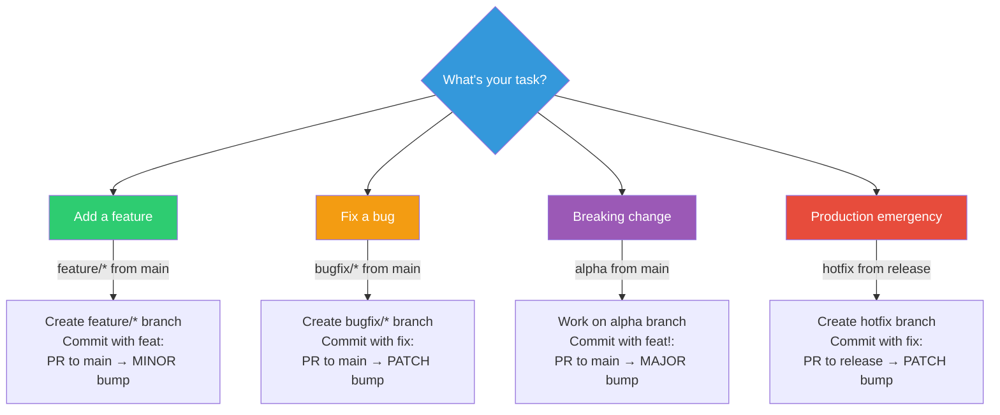

# Quick Reference Guide

📖 **Navigation**: [← README](README.md) | [Quickstart](QUICKSTART.md) | **Quick Reference**

> **🎯 For initial setup**, see [QUICKSTART.md](QUICKSTART.md)  
> **This guide is for daily usage** after Git-Auto-Release is established in your project.

---

## 🚀 Quick Decision Tree

**What do you need to do today?**



**Quick links to detailed workflows:**
- 🎨 [Feature Development](WORKFLOW_EXAMPLES.md#1-feature-development)
- 🐛 [Bug Fixes](WORKFLOW_EXAMPLES.md#2-bug-fixes)
- 💥 [Breaking Changes](WORKFLOW_EXAMPLES.md#4-major-release-breaking-changes)
- 🚨 [Hotfix Emergency](WORKFLOW_EXAMPLES.md#7-hotfix-production-emergency)

---

## 📋 Daily Workflow Commands
---

## 📋 Daily Workflow Commands

### Feature Development (MINOR bump)

```bash
# Start feature
git checkout main
git pull origin main
git checkout -b feature/my-awesome-feature

# Work and commit (use conventional commits)
git add .
git commit -m "feat(module): add awesome feature"

# Push and create PR to main
git push origin feature/my-awesome-feature
# Create PR: feature/my-awesome-feature → main
```

**Result after merge**: `v0.2.0-beta` tag created, VERSION updated

---

### Bug Fix (PATCH bump)

```bash
# Start bugfix
git checkout main
git pull origin main
git checkout -b bugfix/fix-critical-issue

# Work and commit
git add .
git commit -m "fix(module): resolve critical issue"

# Push and create PR to main
git push origin bugfix/fix-critical-issue
# Create PR: bugfix/fix-critical-issue → main
```

**Result after merge**: `v0.1.1-beta` tag created, VERSION updated

---

### Production Release

```bash
# Release tested beta to production
# Create PR: main → release

# On GitHub:
# 1. Create PR from main to release
# 2. Get 2 approvals (review carefully!)
# 3. Merge PR
```

**Result after merge**: `v0.2.0` tag created, GitHub Release published, VERSION updated

---

### Hotfix Emergency (PATCH bump)

```bash
# Start hotfix from release
git checkout release
git pull origin release
git checkout -b hotfix

# Fix and commit
git add .
git commit -m "fix(critical): emergency production fix"

# Push and create PR to release
git push origin hotfix
# Create PR: hotfix → release
```

**Result after merge**: 
- `v1.0.1` tag created and released
- VERSION updated
- Changes auto-sync to main and all active branches

---

---

## 📊 Version Progression Cheat Sheet

### Standard Version Bumps

| Merge Action | Current | Next Version | Tag Created | Notes |
|--------------|---------|--------------|-------------|-------|
| feature/* → main | 0.1.0 | 0.2.0-beta | v0.2.0-beta | MINOR bump |
| bugfix/* → main | 0.1.0 | 0.1.1-beta | v0.1.1-beta | PATCH bump |
| main → release | 1.0.0-beta | 1.0.0 | v1.0.0 | Production release |
| hotfix → release | 1.0.0 | 1.0.1 | v1.0.1 | Emergency fix |

### Major Release Progression

| Step | Merge Action | Version Created | Tag | Branch Created |
|------|--------------|-----------------|-----|----------------|
| 1 | alpha → main | 1.0.0-alpha | v1.0.0-alpha | beta (auto) |
| 2 | beta → main | 1.0.0-beta | v1.0.0-beta | - |
| 3 | main → release | 1.0.0 | v1.0.0 | - |

### Beta Refinement (During Major Release)

| Merge Action | Current | Next Version | Tag Created |
|--------------|---------|--------------|-------------|
| bugfix/* → main | 1.0.0-beta | 1.0.0-beta.1 | v1.0.0-beta.1 |
| bugfix/* → main | 1.0.0-beta.1 | 1.0.0-beta.2 | v1.0.0-beta.2 |

### Build Versions (Development, No Tags)

| Branch Type | Version Format | Example |
|-------------|----------------|---------|
| feature/* | base+commit | v0.1.0+c8d92a14 |
| bugfix/* | base+commit | v0.1.0+f14e2c91 |
| alpha | base+commit | v0.1.0+a3f2b1c8 |
| hotfix | base-hotfix.N | v1.0.0-hotfix.1 |

---

---

## ✍️ Commit Message Format

```
type(scope): short description

[optional body explaining what and why]

[optional footer with breaking changes or issue refs]
```

### Commit Types Reference

| Type | Use For | Example |
|------|---------|---------|
| `feat` | New features | `feat(auth): add OAuth2 support` |
| `fix` | Bug fixes | `fix(api): handle null responses correctly` |
| `feat!` | Breaking changes | `feat!(api): redesign REST endpoints to GraphQL` |
| `docs` | Documentation only | `docs(readme): update installation instructions` |
| `style` | Code formatting | `style(app): fix indentation in main.js` |
| `refactor` | Code restructuring | `refactor(auth): simplify token validation` |
| `perf` | Performance improvements | `perf(db): optimize query performance` |
| `test` | Adding tests | `test(auth): add token validation tests` |
| `chore` | Maintenance tasks | `chore(deps): update dependencies` |

### More Examples

```bash
# Feature with details
git commit -m "feat(dashboard): add user analytics chart

- Added chart component with D3.js
- Integrated with analytics API
- Added date range selector"

# Bug fix with issue reference
git commit -m "fix(login): prevent duplicate submissions

Closes #123"

# Breaking change with migration notes
git commit -m "feat!(api)!: change authentication to JWT

BREAKING CHANGE: API now requires JWT tokens instead of API keys.
Clients must update to use Authorization: Bearer <token> header."
```

> **💡 Important**: Version bumps are determined by **branch type**, not commit messages!
> - `feature/*` → main = MINOR bump
> - `bugfix/*` → main = PATCH bump  
> - `alpha` → main = MAJOR bump
> - `hotfix` → release = PATCH bump
>
> Use conventional commits for clarity and changelog generation, not versioning control.

---

---

## 🛠️ Common Git Commands

### Branch Management

```bash
# View all branches (local and remote)
git branch -a

# Switch branches and pull latest
git checkout main
git pull origin main

# Delete merged feature branch
git branch -d feature/my-feature
git push origin --delete feature/my-feature

# Sync your fork with upstream
git fetch upstream
git checkout main
git merge upstream/main
```

### Tag Operations

```bash
# View all tags
git tag -l

# View tags matching pattern
git tag -l "v1.*"

# Fetch latest tags from remote
git fetch --tags

# View tag details
git show v1.0.0

# Checkout specific tag
git checkout v1.0.0
```

### Commit History

```bash
# View pretty commit history
git log --oneline --graph --all

# View commits by author
git log --author="YourName"

# View commits in date range
git log --since="2024-01-01" --until="2024-12-31"

# Search commits by message
git log --grep="fix(auth)"

# View file history
git log --follow -- path/to/file
```

### Undoing Changes

```bash
# Undo last commit (keep changes staged)
git reset --soft HEAD~1

# Undo last commit (keep changes unstaged)
git reset HEAD~1

# Discard local changes to file
git checkout -- path/to/file

# Discard all local changes
git reset --hard HEAD

# Amend last commit message
git commit --amend -m "new message"

# Amend last commit (add forgotten files)
git add forgotten-file.txt
git commit --amend --no-edit
```

### Interactive Rebase (Clean Up Commits)

```bash
# Squash last 3 commits before PR
git rebase -i HEAD~3

# In the editor:
# - Change 'pick' to 'squash' for commits to combine
# - Save and close
# - Edit combined commit message
```

---

---

## 🔧 Troubleshooting Quick Fixes

### Workflow Not Running

```bash
# 1. Verify workflow file exists
ls .github/workflows/ci-cd-versioned.yml

# 2. Check GitHub Actions is enabled
# Go to: Settings → Actions → General → Enable

# 3. Check branch protection allows workflow
# Settings → Branches → Edit protection rules
```

### Wrong Version Calculated

```bash
# Check current VERSION
cat VERSION

# Verify branch name pattern
git branch --show-current

# Expected patterns:
# - feature/name  → MINOR bump
# - bugfix/name   → PATCH bump  
# - alpha         → MAJOR bump
# - hotfix        → PATCH bump

# View CI logs for version calculation
# GitHub → Actions → Latest run → Calculate Version job
```

### Merge Conflicts in VERSION

```bash
# Always choose the higher version
git checkout --theirs VERSION
git add VERSION
git commit

# Or manually edit VERSION to higher number
echo "1.2.3" > VERSION
git add VERSION
git commit
```

### Tag Already Exists

```bash
# Delete tag locally
git tag -d v1.0.0

# Delete tag remotely
git push origin :refs/tags/v1.0.0

# Force push the corrected commit
# (Only if safe to do so!)
git push --force-with-lease
```

### CI Tests Fail

```bash
# Run tests locally first
npm test
# or
python -m pytest
# or
cargo test

# Check specific job logs
# GitHub → Actions → Failed run → Click failing job

# Re-run failed jobs
# GitHub → Actions → Failed run → Re-run failed jobs
```

### Branch Protection Blocks Merge

```bash
# Ensure all required checks pass
# - Build & Test must be green
# - Calculate Version must complete
# - Required reviews must be approved
# - All conversations must be resolved

# View protection rules
# Settings → Branches → Branch protection rules
```

---

## 📁 Key Files Reference

| File | Purpose | When to Edit |
|------|---------|--------------|
| `VERSION` | Current semantic version | Never manually (auto-updated by CI) |
| `.github/workflows/ci-cd-versioned.yml` | CI/CD automation | When customizing workflow |
| `BRANCH_STRATEGY.md` | Branch rules and flows | Reference only |
| `README.md` | Project overview | Update for your project |

> **⚠️ Warning**: Never manually edit `VERSION` file unless fixing a CI issue. The workflow manages it automatically.

---

## 🔗 Documentation Links

### Getting Started
- 🚀 [Quickstart](QUICKSTART.md) - Initial setup (5 minutes)
- 📘 [Setup Guide](SETUP_GUIDE.md) - Detailed configuration

### Daily Usage  
- ⚡ **Quick Reference** (this page) - Command cheat sheet
- 📖 [Workflow Examples](WORKFLOW_EXAMPLES.md) - Step-by-step scenarios
- 🌳 [Branch Strategy](BRANCH_STRATEGY.md) - Branch rules and flows

### Advanced
- 🎨 [Customization Guide](CUSTOMIZATION.md) - Adapt to your needs
- 📂 [Project Structure](PROJECT_STRUCTURE.md) - File organization
- 📋 [Summary](SUMMARY.md) - High-level overview

---

## 💡 Pro Tips

1. **Commit Often**: Small, focused commits are easier to review and revert
2. **Branch Names**: Use descriptive names like `feature/user-authentication` not `feature/fix`
3. **PR Descriptions**: Link related issues with `Closes #123` or `Fixes #456`
4. **Review Tags**: Check tags regularly with `git fetch --tags && git tag -l`
5. **Test Locally**: Always run tests before pushing with `npm test` or equivalent
6. **Clean Branches**: Delete merged branches to keep repo tidy
7. **Read CI Logs**: When workflow fails, read the logs - they're usually clear about what's wrong

---

**📌 Bookmark this page for daily reference!**


