# Quick Reference Guide

📖 **Navigation**: [← README](../README.md) | [Customization Guide](CUSTOMIZATION.md) | **Quick Reference**

Fast reference for Git Auto Release commands and workflows.

---

## 🚀 Quick Decision Guide

**Need help choosing the right workflow?** Use this flowchart:

```mermaid
flowchart TD
    Start{What do I need?}
    
    Feature[Add a feature]
    Bug[Fix a bug]
    Breaking[Make breaking changes]
    Emergency[Emergency production fix]
    
    Start --> Feature
    Start --> Bug
    Start --> Breaking
    Start --> Emergency
    
    Feature -->|feature/* from main| FeatureFlow[feature/* → main → release<br/>MINOR version bump]
    Bug -->|bugfix/* from main| BugFlow[bugfix/* → main → release<br/>PATCH version bump]
    Breaking -->|alpha from main| BreakingFlow[alpha → main → release<br/>Optional: beta for testing<br/>MAJOR version bump]
    Emergency -->|hotfix from release| EmergencyFlow[hotfix → release<br/>PATCH version bump<br/>Auto-syncs to all branches]
    
    style Start fill:#3498db,color:#fff
    style Feature fill:#2ecc71,color:#fff
    style Bug fill:#f39c12,color:#fff
    style Breaking fill:#9b59b6,color:#fff
    style Emergency fill:#e74c3c,color:#fff
```



### Quick Actions

- **Adding a feature?** → See [Feature Development Workflow](WORKFLOW_EXAMPLES.md#1-feature-development)
- **Fixing a bug?** → See [Bug Fix Workflow](WORKFLOW_EXAMPLES.md#2-bug-fixes)
- **Making breaking changes?** → See [Branch Strategy: Alpha Branch](BRANCH_STRATEGY.md#alpha-branch-optional) and [Major Release Workflow](WORKFLOW_EXAMPLES.md#4-major-release-breaking-changes)
- **Emergency production fix?** → See [Hotfix Workflow](WORKFLOW_EXAMPLES.md#7-hotfix-production-emergency)

---

## Common Commands

### Initial Setup

```bash
# Clone template
git clone https://github.com/CodeOOf/Git-Auto-Release.git my-project
cd my-project

# Set version
echo "0.1.0" > VERSION

# Create branches
git checkout -b alpha
git push -u origin main alpha
git checkout -b release
git push -u origin release
```

### Feature Development

```bash
# Start feature
git checkout main
git pull origin main
git checkout -b feature/my-feature

# Commit
git add .
git commit -m "feat(module): add feature description"

# Push and create PR
git push origin feature/my-feature
# Open PR: feature/my-feature → main
```

### Bug Fix

```bash
# Start bugfix
git checkout main
git checkout -b bugfix/123-fix-issue

# Commit
git commit -m "fix(module): fix issue description"

# Push and create PR
git push origin bugfix/123-fix-issue
# Open PR: bugfix/123-fix-issue → main
```

### Hotfix (Emergency)

```bash
# Start hotfix
git checkout release
git pull origin release
git checkout -b hotfix

# Commit
git commit -m "fix(critical): emergency fix"

# Push and create PR
git push origin hotfix
# Open PR: hotfix → release
```

### Major Release

```bash
# 1. Merge alpha → main
# Creates tag: v1.0.0-alpha

# 2. Test on beta branch (auto-created)
git checkout beta
# Make fixes if needed

# 3. Merge beta → main
# Creates tag: v1.0.0-beta

# 4. Merge main → release
# Creates tag: v1.0.0 (production)
```

---

## Version Progression

| Action | Current | Next Version | Tag Created |
|--------|---------|--------------|-------------|
| Merge feature → main | 0.1.0 | 0.2.0-beta | v0.2.0-beta |
| Merge bugfix → main | 0.1.0 | 0.1.1-beta | v0.1.1-beta |
| Merge bugfix → main (during beta) | 1.0.0-beta | 1.0.0-beta.1 | v1.0.0-beta.1 |
| Merge alpha → main | 0.9.0 | 1.0.0-alpha | v1.0.0-alpha |
| Merge main → release | 1.0.0-beta | 1.0.0 | v1.0.0 |
| Merge hotfix → release | 1.0.0 | 1.0.1 | v1.0.1 |

---

## Build Versions (No Tags)

| Branch | Push Version Example |
|--------|---------------------|
| alpha | v0.1.0+a3f2b1c8 |
| beta | v1.0.0-alpha+7f82b432 |
| feature/* | v0.1.0+c8d92a14 |
| bugfix/* | v0.1.0+f14e2c91 |
| hotfix | v1.0.0-hotfix.1 |

---

## Commit Message Format

```
type(scope): description

[optional body]

[optional footer]
```

### Types

| Type | Description | Version Impact |
|------|-------------|----------------|
| `feat` | New feature | MINOR bump when merged to main |
| `fix` | Bug fix | PATCH bump when merged to main |
| `feat!` | Breaking change | MAJOR bump when merged to main |
| `docs` | Documentation | No version bump |
| `style` | Formatting | No version bump |
| `refactor` | Code restructure | No version bump |
| `test` | Tests | No version bump |
| `chore` | Maintenance | No version bump |

### Examples

```bash
feat(auth): add OAuth2 support
fix(api): handle null responses
feat!(api): redesign REST to GraphQL
docs(readme): update installation steps
test(auth): add token validation tests
chore(deps): update dependencies
```

---

## Branch Protection Rules

### `main` Branch

- ✅ Require PR before merging
- ✅ Require 1 approval
- ✅ Require status checks: `Build & Test`, `Calculate Version`
- ✅ Require conversation resolution

### `release` Branch

- ✅ Require PR before merging
- ✅ Require 2 approvals
- ✅ Require status checks: `Calculate Version`
- ✅ Require conversation resolution

---

## GitHub Actions Workflow

### Triggers

| Event | Branches | Action |
|-------|----------|--------|
| Push | All branches | Build, test, calculate version |
| PR | main, alpha, release | Build, test, show version |
| Merge to main | - | Create tag, update VERSION |
| Merge to release | - | Create tag, release, update VERSION |

### Jobs

1. **version** - Calculate semantic version
2. **build** - Build and test code
3. **docker** - Build and push Docker images (optional)
4. **release** - Create GitHub release (release branch only)
5. **update-version** - Update VERSION file

---

## Troubleshooting

### Workflow Not Running

```bash
# Check workflow file
cat .github/workflows/ci-cd-versioned.yml

# Check GitHub Actions settings
# Settings → Actions → General → Enable
```

### Wrong Version Calculated

```bash
# Check VERSION file
cat VERSION

# Check branch name pattern
git branch --show-current

# Check CI logs for version calculation
```

### Merge Conflicts in VERSION

```bash
# Always use higher version
git checkout --theirs VERSION
git add VERSION
git commit
```

### Tag Already Exists

```bash
# Delete tag locally and remotely
git tag -d v1.0.0
git push origin :refs/tags/v1.0.0

# Re-run the merge
```

### CI Fails on Test

```bash
# Run tests locally
npm test

# Check logs in GitHub Actions
# Actions → Latest workflow run → Build & Test
```

---

## Useful Git Commands

```bash
# View all branches
git branch -a

# View all tags
git tag -l

# Fetch latest tags
git fetch --tags

# View tag details
git show v1.0.0

# View commit history
git log --oneline --graph --all

# Sync with upstream
git fetch upstream
git merge upstream/alpha

# Squash commits before PR
git rebase -i HEAD~3

# Undo last commit (keep changes)
git reset --soft HEAD~1

# View file at specific tag
git show v1.0.0:VERSION
```

---

## Configuration Files

### `.github/workflows/ci-cd-versioned.yml`
Main CI/CD workflow

### `VERSION`
Current version (e.g., `0.1.0`)

### `BRANCH_STRATEGY.md`
Detailed branch strategy documentation

### `README.md`
Project overview and documentation

---

## Quick Links

- [Full Setup Guide](../docs/SETUP_GUIDE.md)
- [Workflow Examples](../docs/WORKFLOW_EXAMPLES.md)
- [Customization Guide](../docs/CUSTOMIZATION.md)
- [Branch Strategy](../BRANCH_STRATEGY.md)

---

## Common Workflows

### Release a Feature

```bash
feature/* → main (via PR) → v0.2.0-beta tag
main → release (via PR) → v0.2.0 tag + Release
```

### Release a Hotfix

```bash
hotfix → release (via PR) → v1.0.1 tag + Release
# Auto-syncs to main and all active branches
```

### Major Version Release

```bash
alpha → main (via PR) → v1.0.0-alpha tag
# Beta branch created
beta → main (via PR) → v1.0.0-beta tag
main → release (via PR) → v1.0.0 tag + Release
```

---

## 📝 Commit Message Conventions

**Use conventional commits for better organization** (version bumps are determined by the branch being merged, not individual commits):


**Important**: Version bumps are determined by **which branch is merged**, not individual commit messages:
- `feature/*` → main = MINOR bump (regardless of commit messages)
- `bugfix/*` → main = PATCH bump (regardless of commit messages)
- `alpha` → main = MAJOR bump (regardless of commit messages)
- `hotfix` → release = PATCH bump (regardless of commit messages)

Commit messages should follow [Conventional Commits](https://www.conventionalcommits.org/) for clarity and changelog generation, but they don't control versioning.

---

**Print this guide for quick reference!** 📋
