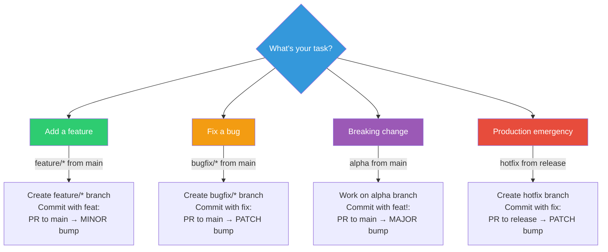

# Reference Guide

📖 **Navigation**: [← README](README.md) | [Quickstart](QUICKSTART.md) | **Reference Guide**

**A comprehensive reference guide for Git-Auto-Release - fully automated semantic versioning and release management.**

> **🎯 For initial setup**, see [QUICKSTART.md](QUICKSTART.md)  
> **This guide is for daily usage** after Git-Auto-Release is established in your project.

---

## 📑 Table of Contents

- [What Is This?](#-what-is-this)
- [What You Get (Template Files)](#-what-you-get-template-files)
- [Key Features](#-key-features)
- [Quick Decision Tree](#-quick-decision-tree)
- [Daily Workflow Commands](#-daily-workflow-commands)
- [Version Progression Cheat Sheet](#-version-progression-cheat-sheet)
- [Commit Message Format](#commit-message-format)
- [Common Git Commands](#️-common-git-commands)
- [Troubleshooting Quick Fixes](#-troubleshooting-quick-fixes)
- [Key Files Reference](#-key-files-reference)
- [Documentation Links](#-documentation-links)
- [Common Use Cases](#-common-use-cases)
- [Customization Points](#️-customization-points)
- [Pro Tips](#-pro-tips)
- [FAQ](#frequently-asked-questions)
- [License & Support](#-license--support)

---

## 🎯 What Is This?

Git-Auto-Release automates your version control workflow using GitHub Actions:

1. **Automatic Version Bumping**: MAJOR/MINOR/PATCH based on branch merges
2. **Semantic Versioning**: Full semver 2.0.0 compliance with pre-release tags
3. **Branch-Based Strategy**: Parallel branching model with clear promotion paths
4. **Zero Maintenance**: No manual VERSION file edits or tag creation
5. **Production Ready**: Includes GitHub Releases, changelogs, and optional Docker support

---

## 📁 What You Get (Template Files)

When you use this template, you receive:

```
Your-Project/
├── .github/workflows/
│   └── ci-cd-versioned.yml          # Automated versioning workflow
├── docs/git-auto-release/           # All template documentation (keep, archive, or remove)
├── README.template.md              # Starter for your project README
├── CONTRIBUTING.template.md        # Starter for your contribution guidelines
├── CHECKLIST.md                    # Implementation checklist
└── VERSION                         # Semantic version tracker (auto-managed)
```

**Note**: Template documentation is in `docs/git-auto-release/` - you can keep it for reference, move to archive, or delete once familiar.

---

## ✨ Key Features

### Automated Versioning
- ✅ **MAJOR bump**: `alpha` → `main` (breaking changes)
- ✅ **MINOR bump**: `feature/*` → `main` (new features)
- ✅ **PATCH bump**: `bugfix/*` → `main` (bug fixes)
- ✅ **Pre-release tags**: `-alpha`, `-beta` suffixes
- ✅ **Build metadata**: `+SHA` for dev builds

### Branch Strategy
- ✅ **Parallel branching**: All branches from `main` (except hotfix from `release`)
- ✅ **Alpha branch**: For breaking changes only
- ✅ **Beta branch**: Auto-created after alpha merge
- ✅ **Release branch**: Production-ready code
- ✅ **Hotfix support**: Emergency production fixes

### CI/CD Automation
- ✅ **Merge commit detection**: Supports both merge and squash merges
- ✅ **VERSION file updates**: Automatic after PR merges
- ✅ **Tag creation**: Auto-tagged with proper semver
- ✅ **GitHub Releases**: Generated with changelogs
- ✅ **Branch syncing**: Keeps branches up-to-date

### Template Design
- ✅ **Placeholder build steps**: Customize for your stack
- ✅ **Commented examples**: Docker, deployment guides
- ✅ **Platform-agnostic**: Works with any language
- ✅ **Documentation included**: All template docs in `docs/git-auto-release/`

---

## 🚀 Quick Decision Tree

**What do you need to do today?**



**Quick links to detailed workflows:**
- 🎨 [Feature Development](WORKFLOW_EXAMPLES.md#1-feature-development)
- 🐛 [Bug Fixes](WORKFLOW_EXAMPLES.md#2-bug-fixes)
- 💥 [Breaking Changes](WORKFLOW_EXAMPLES.md#4-major-release-breaking-changes)
- 🚨 [Hotfix Emergency](WORKFLOW_EXAMPLES.md#7-hotfix-production-emergency)

---

## 📋 Daily Workflow Commands

### Feature Development (MINOR bump)

```bash
# Start feature
git checkout main
git pull origin main
git checkout -b feature/my-awesome-feature

# Work and commit (use conventional commits)
git add .
git commit -m "feat(module): add awesome feature"

# Push and create PR to main
git push origin feature/my-awesome-feature
# Create PR: feature/my-awesome-feature → main
```

**Result after merge**: `v0.2.0-beta` tag created, VERSION updated

---

### Bug Fix (PATCH bump)

```bash
# Start bugfix
git checkout main
git pull origin main
git checkout -b bugfix/fix-critical-issue

# Work and commit
git add .
git commit -m "fix(module): resolve critical issue"

# Push and create PR to main
git push origin bugfix/fix-critical-issue
# Create PR: bugfix/fix-critical-issue → main
```

**Result after merge**: `v0.1.1-beta` tag created, VERSION updated

---

### Production Release

```bash
# Release tested beta to production
# Create PR: main → release

# On GitHub:
# 1. Create PR from main to release
# 2. Get 2 approvals (review carefully!)
# 3. Merge PR
```

**Result after merge**: `v0.2.0` tag created, GitHub Release published, VERSION updated

---

### Hotfix Emergency (PATCH bump)

```bash
# Start hotfix from release
git checkout release
git pull origin release
git checkout -b hotfix

# Fix and commit
git add .
git commit -m "fix(critical): emergency production fix"

# Push and create PR to release
git push origin hotfix
# Create PR: hotfix → release
```

**Result after merge**: 
- `v1.0.1` tag created and released
- VERSION updated
- Changes auto-sync to main and all active branches

---

---

## 📊 Version Progression Cheat Sheet

### Standard Version Bumps

| Merge Action | Current | Next Version | Tag Created | Notes |
|--------------|---------|--------------|-------------|-------|
| feature/* → main | 0.1.0 | 0.2.0-beta | v0.2.0-beta | MINOR bump |
| bugfix/* → main | 0.1.0 | 0.1.1-beta | v0.1.1-beta | PATCH bump |
| main → release | 1.0.0-beta | 1.0.0 | v1.0.0 | Production release |
| hotfix → release | 1.0.0 | 1.0.1 | v1.0.1 | Emergency fix |

### Major Release Progression

| Step | Merge Action | Version Created | Tag | Branch Created |
|------|--------------|-----------------|-----|----------------|
| 1 | alpha → main | 1.0.0-alpha | v1.0.0-alpha | beta (auto) |
| 2 | beta → main | 1.0.0-beta | v1.0.0-beta | - |
| 3 | main → release | 1.0.0 | v1.0.0 | - |

### Beta Refinement (During Major Beta Release)

| Merge Action | Current | Next Version | Tag Created | Notes |
|--------------|---------|--------------|-------------|-------|
| feature/* → main | 1.0.0-beta | 1.0.0-beta.1 | v1.0.0-beta.1 | .N increment (no new minor bump) |
| bugfix/* → main | 1.0.0-beta.1 | 1.0.0-beta.2 | v1.0.0-beta.2 | .N increment |
| feature/* → main | 1.0.0-beta.2 | 1.0.0-beta.3 | v1.0.0-beta.3 | .N increment (no new minor bump) |
| bugfix/* → main | 1.0.0-beta.3 | 1.0.0-beta.4 | v1.0.0-beta.4 | .N increment |

**Key Rule**: During a **major beta release** (VERSION = `X.0.0-beta` from beta branch merge), ALL subsequent merges to main result in `.N` increments. Regular feature/bugfix merges outside of major releases continue to bump versions normally (e.g., `v0.2.0-beta`, `v0.3.0-beta`, `v0.1.1-beta`).

### Build Versions (Development, No Tags)

| Branch Type | Version Format | Example |
|-------------|----------------|---------|
| feature/* | base+commit | v0.1.0+c8d92a14 |
| bugfix/* | base+commit | v0.1.0+f14e2c91 |
| alpha | base+commit | v0.1.0+a3f2b1c8 |
| hotfix | base-hotfix.N | v1.0.0-hotfix.1 |

---

---

## ✍️ Commit Message Format

Following [Conventional Commits](https://www.conventionalcommits.org/) specification for structured, semantic commit messages:

```
type(scope): short description

[optional body explaining what and why]

[optional footer with breaking changes or issue refs]
```

### Commit Types Reference

| Type | Use For | Example |
|------|---------|---------|
| `feat` | New features | `feat(auth): add OAuth2 support` |
| `fix` | Bug fixes | `fix(api): handle null responses correctly` |
| `feat!` | Breaking changes | `feat!(api): redesign REST endpoints to GraphQL` |
| `docs` | Documentation only | `docs(readme): update installation instructions` |
| `style` | Code formatting | `style(app): fix indentation in main.js` |
| `refactor` | Code restructuring | `refactor(auth): simplify token validation` |
| `perf` | Performance improvements | `perf(db): optimize query performance` |
| `test` | Adding tests | `test(auth): add token validation tests` |
| `chore` | Maintenance tasks | `chore(deps): update dependencies` |

### More Examples

```bash
# Feature with details
git commit -m "feat(dashboard): add user analytics chart

- Added chart component with D3.js
- Integrated with analytics API
- Added date range selector"

# Bug fix with issue reference
git commit -m "fix(login): prevent duplicate submissions

Closes #123"

# Breaking change with migration notes
git commit -m "feat!(api)!: change authentication to JWT

BREAKING CHANGE: API now requires JWT tokens instead of API keys.
Clients must update to use Authorization: Bearer <token> header."
```

> **💡 Important**: Version bumps are determined by **branch type**, not commit messages!
> - `feature/*` → main = MINOR bump → `vX.Y+1.0-beta` (normal beta tag)
> - `bugfix/*` → main = PATCH bump → `vX.Y.Z+1-beta` (normal beta tag)
> - `alpha` → main = MAJOR bump → `vX+1.0.0-alpha` (creates beta branch)
> - `beta` branch → main = `vX.0.0-beta` (major beta release)
> - ANY merge → main during **major beta** (VERSION = `X.0.0-beta`) = `.N` increment (e.g., v1.0.0-beta.1, .2, .3)
> - `hotfix` → release = PATCH bump
>
> **During major beta release only**: No new major/minor bumps allowed - all changes get `.N` increments!
>
> Use conventional commits for clarity and changelog generation, not versioning control.

---

---

## 🛠️ Common Git Commands

### Branch Management

```bash
# View all branches (local and remote)
git branch -a

# Switch branches and pull latest
git checkout main
git pull origin main

# Delete merged feature branch
git branch -d feature/my-feature
git push origin --delete feature/my-feature

# Sync your fork with upstream
git fetch upstream
git checkout main
git merge upstream/main
```

### Tag Operations

```bash
# View all tags
git tag -l

# View tags matching pattern
git tag -l "v1.*"

# Fetch latest tags from remote
git fetch --tags

# View tag details
git show v1.0.0

# Checkout specific tag
git checkout v1.0.0
```

### Commit History

```bash
# View pretty commit history
git log --oneline --graph --all

# View commits by author
git log --author="YourName"

# View commits in date range
git log --since="2024-01-01" --until="2024-12-31"

# Search commits by message
git log --grep="fix(auth)"

# View file history
git log --follow -- path/to/file
```

### Undoing Changes

```bash
# Undo last commit (keep changes staged)
git reset --soft HEAD~1

# Undo last commit (keep changes unstaged)
git reset HEAD~1

# Discard local changes to file
git checkout -- path/to/file

# Discard all local changes
git reset --hard HEAD

# Amend last commit message
git commit --amend -m "new message"

# Amend last commit (add forgotten files)
git add forgotten-file.txt
git commit --amend --no-edit
```

### Interactive Rebase (Clean Up Commits)

```bash
# Squash last 3 commits before PR
git rebase -i HEAD~3

# In the editor:
# - Change 'pick' to 'squash' for commits to combine
# - Save and close
# - Edit combined commit message
```

---

---

## 🔧 Troubleshooting Quick Fixes

### Workflow Not Running

```bash
# 1. Verify workflow file exists
ls .github/workflows/ci-cd-versioned.yml

# 2. Check GitHub Actions is enabled
# Go to: Settings → Actions → General → Enable

# 3. Check branch protection allows workflow
# Settings → Branches → Edit protection rules
```

### Wrong Version Calculated

```bash
# Check current VERSION
cat VERSION

# Verify branch name pattern
git branch --show-current

# Expected patterns:
# - feature/name  → MINOR bump
# - bugfix/name   → PATCH bump  
# - alpha         → MAJOR bump
# - hotfix        → PATCH bump

# View CI logs for version calculation
# GitHub → Actions → Latest run → Calculate Version job
```

### Merge Conflicts in VERSION

```bash
# Always choose the higher version
git checkout --theirs VERSION
git add VERSION
git commit

# Or manually edit VERSION to higher number
echo "1.2.3" > VERSION
git add VERSION
git commit
```

### Tag Already Exists

```bash
# Delete tag locally
git tag -d v1.0.0

# Delete tag remotely
git push origin :refs/tags/v1.0.0

# Force push the corrected commit
# (Only if safe to do so!)
git push --force-with-lease
```

### CI Tests Fail

```bash
# Run tests locally first
npm test
# or
python -m pytest
# or
cargo test

# Check specific job logs
# GitHub → Actions → Failed run → Click failing job

# Re-run failed jobs
# GitHub → Actions → Failed run → Re-run failed jobs
```

### Branch Protection Blocks Merge

```bash
# Ensure all required checks pass
# - Build & Test must be green
# - Calculate Version must complete
# - Required reviews must be approved
# - All conversations must be resolved

# View protection rules
# Settings → Branches → Branch protection rules
```

---

## 📁 Key Files Reference

| File | Purpose | When to Edit |
|------|---------|--------------|
| `VERSION` | Current semantic version | Never manually (auto-updated by CI) |
| `.github/workflows/ci-cd-versioned.yml` | CI/CD automation | When customizing workflow |
| `BRANCH_STRATEGY.md` | Branch rules and flows | Reference only |
| `README.md` | Project overview | Update for your project |

> **⚠️ Warning**: Never manually edit `VERSION` file unless fixing a CI issue. The workflow manages it automatically.

---

## 🔗 Documentation Links

### Getting Started
- 🚀 [Quickstart](QUICKSTART.md) - Initial setup (5 minutes)
- 📘 [Setup Guide](SETUP_GUIDE.md) - Detailed configuration

### Daily Usage  
- ⚡ **Reference Guide** (this page) - Comprehensive reference
- 📖 [Workflow Examples](WORKFLOW_EXAMPLES.md) - Step-by-step scenarios
- 🌳 [Branch Strategy](BRANCH_STRATEGY.md) - Branch rules and flows

### Advanced
- 🎨 [Customization Guide](CUSTOMIZATION.md) - Adapt to your needs
- 📂 [Project Structure](PROJECT_STRUCTURE.md) - File organization

---

## 🎯 Common Use Cases

Perfect for:
- ✅ **SaaS applications**: Clear staging → production promotion path
- ✅ **Open source projects**: Transparent and predictable releases
- ✅ **Enterprise software**: Controlled, auditable version control
- ✅ **Microservices**: Consistent versioning across services
- ✅ **APIs**: Breaking changes clearly marked with MAJOR bumps
- ✅ **Libraries**: Semantic versioning for package dependents

---

## 🛠️ Customization Points

### Easy Customizations
- Change placeholder build/test commands for your language
- Remove Docker examples if not needed
- Adjust branch protection rules
- Modify release notes format

### Advanced Customizations
- Adapt workflow for GitLab CI, Bitbucket Pipelines, Jenkins
- Change version bump logic
- Add deployment steps
- Integrate with external tools

See [CUSTOMIZATION.md](CUSTOMIZATION.md) for platform-specific guides.

---

## 💡 Pro Tips

1. **Commit Often**: Small, focused commits are easier to review and revert
2. **Branch Names**: Use descriptive names like `feature/user-authentication` not `feature/fix`
3. **PR Descriptions**: Link related issues with `Closes #123` or `Fixes #456`
4. **Review Tags**: Check tags regularly with `git fetch --tags && git tag -l`
5. **Test Locally**: Always run tests before pushing with `npm test` or equivalent
6. **Clean Branches**: Delete merged branches to keep repo tidy
7. **Read CI Logs**: When workflow fails, read the logs - they're usually clear about what's wrong

---

## ❓ Frequently Asked Questions

### How do I fix "VERSION file has conflicts"?

Always choose the higher version number:
```bash
git checkout --theirs VERSION
git add VERSION
git commit
```

### Can I manually edit the VERSION file?

**No**, unless you're fixing a CI issue. The workflow automatically manages VERSION after every merge. Manual edits will be overwritten.

### What if I accidentally merged to the wrong branch?

1. Revert the merge commit:
   ```bash
   git revert -m 1 <merge-commit-hash>
   git push
   ```
2. Create PR to the correct branch
3. Delete any incorrect tags if created

### How do I skip CI for a commit?

Add `[skip ci]` or `[ci skip]` to your commit message:
```bash
git commit -m "docs: update README [skip ci]"
```

### Why is my PR showing the wrong version?

Check your branch name matches the pattern:
- `feature/*` → MINOR bump
- `bugfix/*` → PATCH bump
- `alpha` → MAJOR bump
- `hotfix` → PATCH bump (from release)

### Can I use this with monorepos?

Yes, but requires customization. See [CUSTOMIZATION.md](CUSTOMIZATION.md) for monorepo configuration examples.

### How do I change the version bump logic?

Edit `.github/workflows/ci-cd-versioned.yml` in the version calculation job. See [CUSTOMIZATION.md](CUSTOMIZATION.md) for details.

### What if I need to release multiple features together?

Merge all feature branches to `main` first (each gets a beta tag), then when ready, merge `main` → `release` for one production release.

### My feature became a breaking change mid-development. What do I do?

If you realize your feature branch will introduce breaking changes:

1. **Create alpha branch** (if it doesn't exist):
   ```bash
   git checkout main
   git checkout -b alpha
   git push -u origin alpha
   ```

2. **Merge your feature branch into alpha**:
   ```bash
   git checkout alpha
   git merge feature/your-feature
   # Or create PR: feature/your-feature → alpha
   ```

3. **Continue development on alpha**:
   ```bash
   git checkout alpha
   # Make more changes
   git commit -m "feat!: breaking change description"
   git push origin alpha
   ```

4. **When ready, merge alpha → main** for v1.0.0-alpha tag

**Note**: Use `feat!:` in commit messages to mark breaking changes clearly for changelog generation.

### Can I use squash merges?

Yes! The workflow detects both regular merges (2 parents) and squash merges (PR# in commit message).

### How do I rollback a release?

1. **For beta/alpha**: Revert the merge to main
2. **For production**: Create a hotfix branch from release with the fix, or revert and create new release

### Why did my workflow fail with "tag already exists"?

Someone may have manually created the tag. Delete it and re-run:
```bash
git tag -d v1.0.0
git push origin :refs/tags/v1.0.0
```

### Can I customize the tag format?

Yes, edit the workflow's tag creation step. Default is `v{VERSION}` (e.g., v1.0.0).

### Can I merge alpha (breaking changes) during a major beta release?

**No, alpha merges to main are NOT allowed during a major beta release.** Here's why and what to do:

**Why Not?**
- A major version bump is the highest possible version increment
- Once you're in a major beta release (e.g., VERSION = `1.0.0-beta` from beta branch merge), you've already claimed that major version
- There cannot be two major bumps in parallel - you can't have `v1.0.0-beta` and start `v2.0.0-alpha` simultaneously
- During major beta release (VERSION = `X.0.0-beta`), ALL merges to main (feature or bugfix) must increment build metadata (`.N`) only

**Note**: Regular feature/bugfix merges outside of major beta releases continue to create normal beta tags: `v0.2.0-beta`, `v0.3.0-beta`, etc.

**What To Do If You Have Breaking Changes During Beta?**

**Option 1: Delay Breaking Changes (Recommended)**
1. Complete current beta and release to production (`v1.0.0`)
2. Then create alpha branch for breaking changes
3. Merge alpha → main for `v2.0.0-alpha`
4. Create new beta branch and proceed with `v2.0.0-beta`

**Option 2: Abandon Current Major Beta and Restart**
1. If the major beta is not production-ready and needs major changes, preserve the work in alpha but remove it from main:
   ```bash
   # Step 1: Create alpha branch from current main (preserves all the work)
   git checkout main
   git checkout -b alpha
   git push -u origin alpha
   
   # Step 2: Reset main to before the major version bump
   # Find the commit hash before alpha was originally merged to main
   git log --oneline main  # Find the commit before the alpha merge
   git checkout main
   git reset --hard <commit-hash-before-alpha-merge>
   
   # Step 3: Verify and restore VERSION file to pre-alpha state
   # VERSION should now be back to what it was (e.g., 0.x.x)
   cat VERSION  # Verify it's correct (e.g., 0.5.0, not 1.0.0-alpha)
   
   # Push the reset
   git push origin main --force  # ⚠️ Use with caution, coordinate with team
   
   # Step 4: Delete all major beta tags (work continues in alpha, tags removed)
   git tag -d v1.0.0-alpha v1.0.0-beta
   git push origin :refs/tags/v1.0.0-alpha :refs/tags/v1.0.0-beta
   
   # Step 5: Continue development in alpha
   git checkout alpha
   # All the work from the beta is preserved here
   # VERSION in alpha still contains 1.0.0-beta (or latest .N version)
   git merge feature/your-breaking-change  # Add more breaking changes if needed
   git commit -m "feat!: incorporate additional breaking changes"
   git push origin alpha
   
   # When ready, restart the major release process:
   # Create PR: alpha → main (will create v1.0.0-alpha, update VERSION to 1.0.0-alpha, and create beta branch)
   ```
   
   **⚠️ Important**: This approach uses `git reset --hard` and force push, which rewrites main's history. The work continues in alpha as if the merge to main never happened. VERSION in main reverts to pre-alpha state, while VERSION in alpha retains the major version. Coordinate with your team!

**Option 3: Start New Alpha for Next Major Version**
1. If you need breaking changes but current major beta must still be released:
   ```bash
   # Step 1: Create new alpha branch for next major version (v2.x.x)
   git checkout main
   git checkout -b alpha
   git push -u origin alpha
   
   # Step 2: Develop breaking changes in this new alpha
   git checkout alpha
   git merge feature/your-breaking-change
   git commit -m "feat!: breaking changes for v2.0.0"
   git push origin alpha
   # Note: VERSION in alpha still shows current main version (e.g., 1.0.0-beta.N)
   # It will be bumped to 2.0.0-alpha when merged to main
   
   # Step 3: Complete and release current major beta first
   # Continue with v1.0.0-beta → v1.0.0 release process
   # Create PR: main → release (produces v1.0.0, VERSION becomes 1.0.0)
   
   # Step 4: AFTER v1.0.0 is released, merge new alpha
   # Only then can you merge: alpha → main
   # This will create v2.0.0-alpha and update VERSION to 2.0.0-alpha
   ```
   
   **Important**: The new alpha branch CANNOT be merged to main until the current major version is released to production. This ensures version integrity and prevents conflicting major version bumps. VERSION in main must reach production (X.0.0) before starting the next major cycle (X+1.0.0-alpha).

**Remember**: During a **major beta release** (VERSION = `X.0.0-beta`), the version represents a contract. Once you're in `v1.0.0-beta`, you're committed to releasing `v1.0.0` (or abandoning it). Breaking changes mean a new major version cycle.

### How do I test workflow changes safely?

1. Create a test repository
2. Copy your modified workflow
3. Test all merge scenarios
4. Once confirmed, apply to production repo

---

## 📄 License & Support

### License

This template is released under the **MIT License** - see [LICENSE](LICENSE) for full text.

You are free to:
- ✅ Use this template for commercial or personal projects
- ✅ Modify and adapt to your needs  
- ✅ Distribute and share

**Your project built with this template can use any license you choose.**

### Support & Contributing

**Contributions welcome!** See [CONTRIBUTING.md](../../CONTRIBUTING.md) for guidelines.

**Need help?**
- 📖 Documentation: Complete guides in [docs/git-auto-release/](.)
- 🐛 Issues: [GitHub Issues](https://github.com/CodeOOf/Git-Auto-Release/issues)
- 💬 Discussions: [GitHub Discussions](https://github.com/CodeOOf/Git-Auto-Release/discussions)

---

**📌 Bookmark this page for daily reference!**

**⏱️ Setup Time**: ~5 minutes | **🔄 Maintenance**: Zero - fully automated! | **💪 Production Ready**: Use immediately!


