```mermaid
graph TB
    feature[feature/my-feature<br/>No protection<br/>✅ Push directly]
    alpha[alpha<br/>Optional protection<br/>Status checks: Build & Test optional]
    main[main<br/>✅ Protected<br/>✅ Require PR<br/>⭐ 1 Approval<br/>✅ Status checks: Build & Test, Calculate Version]
    release[release<br/>✅✅ Highly Protected<br/>✅ Require PR<br/>⭐⭐ 2 Approvals<br/>✅ Status checks: Calculate Version]
    
    feature -->|PR Required<br/>No approvals| alpha
    alpha -->|PR Required<br/>⭐ 1 approval<br/>✅ Status checks| main
    main -->|PR Required<br/>⭐⭐ 2 approvals<br/>✅ Status checks| release
    
    style feature fill:#2ecc71,color:#fff
    style alpha fill:#9b59b6,color:#fff
    style main fill:#3498db,color:#fff
    style release fill:#e74c3c,color:#fff
```

# Setup Guide

📖 **Navigation**: [← README](README.md) | [Quick Start](QUICKSTART.md) | **Setup Guide** | [Workflow Examples →](WORKFLOW_EXAMPLES.md)

**Detailed configuration guide for Git Auto Release.**

> 💡 **Just want to get started?** See [Quick Start Guide](QUICKSTART.md) for a 5-minute setup.

This guide provides in-depth setup instructions, advanced configuration options, and platform-specific customizations.

---

## Table of Contents

1. [Prerequisites](#1-prerequisites)
2. [Initial Setup](#2-initial-setup)
3. [Configure Branch Protection](#3-configure-branch-protection)
4. [Configure Git Commit Signing](#4-configure-git-commit-signing-optional)
5. [Customize the Workflow](#5-customize-the-workflow)
6. [Test Your Setup](#6-test-your-setup)
7. [Troubleshooting](#7-troubleshooting)

---

## 1. Prerequisites

- Git installed locally
- GitHub account (or GitLab/Bitbucket)
- Basic understanding of Git branches and pull requests
- Familiarity with GitHub Actions (or equivalent CI/CD)

---

## 2. Initial Setup

> 📚 **For quick setup instructions**, see [Quick Start Guide](QUICKSTART.md).

This section provides detailed explanations for both setup methods.

### Understanding the Template Structure

The template includes:
- **VERSION file**: Tracks current version (e.g., starts at `0.1.0`, becomes `1.0.0-beta` after alpha merge)
- **README.template.md**: Your project README starter
- **CONTRIBUTING.template.md**: Contribution guidelines starter
- **.github/workflows/ci-cd-versioned.yml**: Automated versioning workflow
- **docs/git-auto-release/**: All template documentation

### Option A: Use GitHub Template (Recommended)

**Advantages:**
- ✅ Fastest setup
- ✅ Preserves all branches automatically
- ✅ GitHub handles initialization

**Steps:**
1. Click **"Use this template"** on GitHub
2. Name your repository
3. Create repository
4. Clone locally:
   ```bash
   git clone https://github.com/YOUR_USERNAME/YOUR_REPO.git
   cd YOUR_REPO
   ```

### Option B: Manual Clone and Setup

**Advantages:**
- ✅ Full control over repository initialization
- ✅ Can customize before first commit
- ✅ Good for offline or private setups

**Steps:**
```bash
# Clone with your project name
git clone https://github.com/CodeOOf/Git-Auto-Release.git my-project
cd my-project

# Remove Git history
rm -rf .git

# Set initial version
echo "0.1.0" > VERSION

# Replace template files
rm README.md CONTRIBUTING.md
mv README.template.md README.md
mv CONTRIBUTING.template.md CONTRIBUTING.md

# Edit README.md and CONTRIBUTING.md with your project details

# Initialize Git
git init
git checkout -b main
git add .
git commit -m "chore: initialize project from Git-Auto-Release template"

# Add remote and push
git remote add origin https://github.com/YOUR_USERNAME/YOUR_REPO.git
git push -u origin main

# Create release branch
git checkout -b release
git push -u origin release
git checkout main
```

### Customize Your Project Files

After setup, edit these files:

**README.md:**
- Project name and description
- Installation instructions
- Usage examples
- Link to template docs: `docs/git-auto-release/`

**CONTRIBUTING.md:**
- Contribution guidelines
- Code of conduct
- Development setup
- Commit message conventions

---

## 3. Configure Branch Protection

**Protect your branches to ensure code quality and version control integrity.**

### 🔐 Branch Protection Overview

**Visual representation of recommended protection levels:**



## 3. Configure Branch Protection

> 📚 **Quick setup**: See [Quick Start Guide - Branch Protection](QUICKSTART.md#step-2-branch-protection-2-min) for basic configuration.

This section provides detailed protection rules and platform-specific instructions.

**Protect your branches to ensure code quality and version control integrity.**

### 🔐 Branch Protection Overview

**Visual representation of recommended protection levels:**



```mermaid
graph TB
    feature[feature/my-feature<br/>No protection<br/>✅ Push directly]
    bugfix[bugfix/my-fix<br/>No protection<br/>✅ Push directly]
    alpha[alpha<br/>Optional protection<br/>Status checks recommended]
    beta[beta<br/>Auto-created<br/>No direct commits]
    main[main<br/>✅ Protected<br/>✅ Require PR<br/>⭐ 1 Approval<br/>✅ Status checks]
    release[release<br/>✅✅ Highly Protected<br/>✅ Require PR<br/>⭐⭐ 2 Approvals<br/>✅ Status checks]
    
    feature -->|PR| main
    bugfix -->|PR| main
    alpha -->|PR| main
    beta -->|PR| main
    main -->|PR| release
    
    style feature fill:#2ecc71,color:#fff
    style bugfix fill:#2ecc71,color:#fff
    style alpha fill:#9b59b6,color:#fff
    style beta fill:#3498db,color:#fff
    style main fill:#3498db,color:#fff
    style release fill:#e74c3c,color:#fff
```

**Protection Levels:**
- **feature/**, **bugfix/** branches: No protection (development freedom)
- **alpha**: Optional protection with status checks (for breaking changes)
- **beta**: Auto-created from main, no direct commits
- **main**: Protected with 1 approval, all status checks required
- **release**: Highly protected with 2 approvals, production-ready

---

### Platform-Specific Setup

Navigate to branch protection settings:
- **GitHub**: Settings → Branches → Add branch protection rule
- **GitLab**: Settings → Repository → Protected Branches
- **Bitbucket**: Repository Settings → Branch Permissions

### Protect the `main` Branch

**Rule name/pattern:** `main`

**Required settings:**
- ✅ **Require pull request before merging**
- ✅ **Require approvals**: 1
- ✅ **Require status checks to pass**
  - Required checks:
    - `Build & Test` (placeholder job)
    - `Calculate Version` (from version job)
- ✅ **Require branches to be up to date**
- ✅ **Require conversation resolution before merging**
- ✅ **Do not allow bypassing settings**

**Optional but recommended:**
- ✅ **Dismiss stale approvals when new commits pushed**
- ✅ **Require approval of most recent push**

### Protect the `release` Branch

**Rule name/pattern:** `release`

**Required settings:**
- ✅ **Require pull request before merging**
- ✅ **Require approvals**: 2 (higher for production)
- ✅ **Require status checks to pass**
  - Required checks:
    - `Calculate Version`
- ✅ **Require branches to be up to date**  
- ✅ **Require conversation resolution**
- ✅ **Do not allow bypassing settings**

**Additional protection:**
- ✅ **Dismiss stale approvals when new commits pushed**
- ✅ **Restrict who can push** (optional: only maintainers)

### Optional: Protect `alpha` Branch

For stricter control over breaking changes:

**Rule name/pattern:** `alpha`

**Settings:**
- ✅ **Require status checks**: `Build & Test`
- Consider requiring 1 approval for feature merges
- Useful for teams working on major version changes

---

## 4. Configure Git Commit Signing (Optional)

Secure your commits with GPG signing for better traceability and security.

### Generate GPG Key

```bash
# Generate a new GPG key
gpg --full-generate-key

# Select:
# - Kind: (1) RSA and RSA
# - Key size: 4096 bits
# - Expiration: 0 (does not expire) or your preference
# - Enter your name and email (must match your Git email)
```

### Configure Git to Use GPG

```bash
# List your GPG keys
gpg --list-secret-keys --keyid-format=long

# Example output:
# sec   rsa4096/3AA5C34371567BD2 2024-01-01 [SC]
# The key ID is: 3AA5C34371567BD2

# Configure Git to use your GPG key
git config --global user.signingkey YOUR_KEY_ID
git config --global commit.gpgsign true
git config --global tag.gpgsign true
```

### Add GPG Key to GitHub/GitLab

**For GitHub:**
```bash
# Export your public key
gpg --armor --export YOUR_KEY_ID

# Copy the output (including BEGIN/END lines)
# Go to GitHub → Settings → SSH and GPG keys → New GPG key
# Paste and save
```

**For GitLab:**
```bash
# Same export process
# Go to GitLab → Preferences → GPG Keys
# Paste and save
```

### Verify GPG Signing

```bash
# Make a signed commit
git commit -S -m "test: verify GPG signing"

# Verify the signature
git log --show-signature -1
```

---

## 5. Customize the Workflow

The CI/CD workflow is designed to handle version automation while allowing you to integrate your own build, test, and deployment processes.

### 🔄 CI/CD Workflow Architecture

**Visual overview of the automated CI/CD pipeline:**

```mermaid
flowchart TD
    Event[Git Push/PR Event]
    
    CalcVer[Job 1: Calculate Version<br/>• Read VERSION file<br/>• Detect branch name<br/>• Detect PR source<br/>• Calculate semantic version<br/>• Determine if tag needed]
    
    Build[Job 2: Build & Test<br/>• Checkout code<br/>• Setup environment<br/>• Install dependencies<br/>• Build with version<br/>• Run tests<br/>• Upload artifacts]
    
    Docker[Job 3: Docker Build Optional<br/>• Only on main/release<br/>• Build images<br/>• Tag with version<br/>• Push to registry]
    
    Release[Job 4: Create Release<br/>Release branch only<br/>• Create Git tag<br/>• Generate changelog<br/>• Create GitHub Release<br/>• Sync to main]
    
    Update[Job 5: Update VERSION<br/>• Calculate new VERSION<br/>• Write to file<br/>• Commit and push skip ci]
    
    Event --> CalcVer --> Build --> Docker --> Release --> Update
    
    style Event fill:#95a5a6,color:#fff
    style CalcVer fill:#3498db,color:#fff
    style Build fill:#2ecc71,color:#fff
    style Docker fill:#9b59b6,color:#fff
    style Release fill:#e74c3c,color:#fff
    style Update fill:#f39c12,color:#fff
```



**Key Points:**
- **Job 1 (Calculate Version)**: Core functionality - determines semantic version and tags
- **Job 2 (Build & Test)**: **Customize this** with your project's build commands
- **Job 3 (Docker)**: Optional - only customize if using Docker
- **Job 4 (Release)**: Core functionality - creates releases on production
- **Job 5 (Update VERSION)**: Core functionality - maintains VERSION file

**For platform-specific customization (GitLab CI, Jenkins, etc.), see [Customization Guide](CUSTOMIZATION.md).**

---

### Understanding the Workflow Structure

The workflow consists of independent jobs:

1. **`version`** - Calculates semantic version (core functionality)
2. **`build`** - Your custom build/test steps
3. **`release`** - Creates tags and releases (core functionality)
4. **`update_version`** - Updates VERSION file (core functionality)
5. **`sync_branches`** - Syncs branches with main (core functionality)

**Important**: Only modify the `build` job. The `version`, `release`, `update_version`, and `sync_branches` jobs handle the version automation and should remain unchanged.

### Customize Build Steps

Edit `.github/workflows/ci-cd-versioned.yml` in the `build` job:

```yaml
build:
  name: Build and Test
  runs-on: ubuntu-latest
  needs: version
  
  steps:
    - name: Checkout code
      uses: actions/checkout@v4
    
    # Replace these steps with your project's build commands
    - name: Setup your environment
      run: |
        # Install your dependencies
        # Example: npm install, pip install, cargo build, etc.
    
    - name: Build
      run: |
        # Your build commands
        echo "Building version ${{ needs.version.outputs.version }}"
    
    - name: Test
      run: |
        # Your test commands
        echo "Running tests..."
    
    # Optional: Upload artifacts
    - name: Upload build artifacts
      uses: actions/upload-artifact@v4
      with:
        name: build-artifacts
        path: ./dist  # Adjust to your build output path
```

### Add Additional Jobs

You can add custom jobs without affecting version automation:

```yaml
# Add after the build job
lint:
  name: Code Quality
  runs-on: ubuntu-latest
  
  steps:
    - name: Checkout code
      uses: actions/checkout@v4
    
    - name: Run linter
      run: |
        # Your linting commands

security-scan:
  name: Security Scan
  runs-on: ubuntu-latest
  
  steps:
    - name: Checkout code
      uses: actions/checkout@v4
    
    - name: Run security scan
      run: |
        # Your security scanning tools

# Update release job to depend on your new jobs
release:
  name: Create Release
  runs-on: ubuntu-latest
  needs: [version, build, lint, security-scan]  # Add your jobs here
  if: github.ref_name == 'release' && github.event_name == 'push'
  # ... rest of release job
```

### Integrate External CI/CD Tools

You can trigger external pipelines while keeping version automation:

```yaml
trigger-external:
  name: Trigger External Pipeline
  runs-on: ubuntu-latest
  needs: [version, build]
  if: github.ref_name == 'main'
  
  steps:
    - name: Trigger Jenkins
      run: |
        curl -X POST "https://jenkins.example.com/job/my-job/build" \
          -H "Authorization: Bearer ${{ secrets.JENKINS_TOKEN }}" \
          -d "VERSION=${{ needs.version.outputs.version }}"
    
    - name: Trigger GitLab Pipeline
      run: |
        curl -X POST "https://gitlab.com/api/v4/projects/PROJECT_ID/trigger/pipeline" \
          -F "token=${{ secrets.GITLAB_TRIGGER_TOKEN }}" \
          -F "ref=main" \
          -F "variables[VERSION]=${{ needs.version.outputs.version }}"
```

### Access Version Information

All jobs can access the calculated version:

```yaml
your-custom-job:
  name: Custom Job
  runs-on: ubuntu-latest
  needs: version  # Add this dependency
  
  steps:
    - name: Use version
      run: |
        echo "Version: ${{ needs.version.outputs.version }}"
        echo "Tag: ${{ needs.version.outputs.tag }}"
        echo "Is Release: ${{ needs.version.outputs.is_release }}"
```

### Customize Release Notes

Edit the release body in the `release` job:

```yaml
- name: Create GitHub Release
  uses: softprops/action-gh-release@v1
  with:
    body: |
      ## 🎉 My Awesome Project ${{ needs.version.outputs.tag }}
      
      ### What's New
      
      ${{ steps.changelog.outputs.changelog }}
      
      ### Installation
      
      ```bash
      npm install my-project@${{ needs.version.outputs.version }}
      ```
```

---

## 6. Test Your Setup

### Test 1: Feature Development Workflow

```bash
# Create a feature branch from main
git checkout main
git pull origin main
git checkout -b feature/test-setup

# Make a change
echo "# Test Feature" > test.md
git add test.md
git commit -m "feat(test): add test feature"
git push origin feature/test-setup
```

**On your Git platform:**
1. Create PR: `feature/test-setup` → `main`
2. Wait for CI to complete
3. Check build version in logs (should be `v0.1.0+SHA`)
4. Merge the PR
5. Verify tag created: `v0.2.0-beta` (MINOR bump from feature)
6. Verify VERSION file updated to: `0.2.0-beta`

### Test 2: Production Release

```bash
# Create PR: main → release
# After merge, verify:
# 1. Tag created: v0.2.0 (clean production version)
# 2. VERSION file updated to: 0.2.0
# 3. GitHub/GitLab Release created
```

Check the tags:
```bash
git fetch --tags
git tag -l
```

You should see `v0.2.0-beta`

### Test 3: Production Release

```bash
# Open PR: main → release
# During PR: Build versions show v0.2.0-rc.1, v0.2.0-rc.2, etc.
# After merge:
# 1. Tag created: v0.2.0
# 2. VERSION file updated to: 0.2.0
# 3. GitHub Release created
```

Check the releases:
- Go to **GitHub → Releases**
- You should see release `v0.2.0` with changelog

---

## 7. Troubleshooting

### Problem: Workflow Not Running

**Solution:**
- Check if GitHub Actions is enabled: **Settings → Actions → General**
- Ensure workflow file is in `.github/workflows/` directory
- Verify YAML syntax: Use [YAML Lint](https://www.yamllint.com/)

### Problem: Version Not Calculating Correctly

**Solution:**
- Check the `VERSION` file exists and contains valid semver (e.g., `0.1.0`)
- Ensure branch names match patterns: `feature/*`, `bugfix/*`, etc.
- Review workflow logs for version calculation details

### Problem: Tag Not Created

**Solution:**
- Tags only create on merges to `main` or `release`
- Check if the merge completed successfully
- Verify the workflow reached the tag creation step

### Problem: Branch Protection Blocks Auto-Commits

**Solution:**
- The VERSION file update commits use `[skip ci]` to avoid loops
- Ensure the workflow has write permissions:
  ```yaml
  permissions:
    contents: write
  ```

### Problem: GPG Signature Verification Fails

**Solution:**
- Ensure your GPG key is added to your Git platform (GitHub/GitLab)
- Verify the key ID matches: `git config --global user.signingkey`
- Check that your Git email matches the GPG key email
- On Windows, you may need to configure GPG program path:
  ```bash
  git config --global gpg.program "C:/Program Files (x86)/GnuPG/bin/gpg.exe"
  ```

### Problem: Merge Conflicts in VERSION

**Solution:**
- Always use the higher version number
- Let CI/CD update VERSION on next merge
- Or manually resolve to the correct next version

---

## Next Steps

✅ **Setup Complete!** You're ready to use Git-Auto-Release.

**Recommended actions:**
1. Read [WORKFLOW_EXAMPLES.md](WORKFLOW_EXAMPLES.md) for common scenarios
2. Review [BRANCH_STRATEGY.md](../BRANCH_STRATEGY.md) for detailed branching rules
3. Customize the CI/CD further for your deployment needs
4. Share the branch strategy with your team

**Need help?** Check the [FAQ](../README.md#-faq) or open an issue on GitHub.

---

**Happy automating! 🚀**
