# Workflow Examples

📖 **Navigation**: [← README](../README.md) | [Quick Start](../QUICKSTART.md) | [Setup Guide](SETUP_GUIDE.md) | **Workflow Examples** | [Branch Strategy →](../BRANCH_STRATEGY.md)

Real-world examples of using Git Auto Release for different scenarios.

---

## 📦 Version Flow Diagrams

**Visual overview of how versions progress through different release types:**

### Feature Release (MINOR Bump)

```mermaid
flowchart TD
    Start([Developer creates<br/>feature/login from main])
    Develop[Develop and commit changes]
    Push[Push to feature/login branch<br/>Build: v0.1.0+abc123 no tag]
    PR1[Create PR: feature/login → main]
    Review1[Review and approve]
    Merge1[Merge to main<br/>✅ Tag: v0.2.0-beta<br/>✅ VERSION: 0.2.0-beta]
    PR2[Create PR: main → release]
    Review2[Review and approve]
    Merge2[Merge to release<br/>✅ Tag: v0.2.0<br/>✅ VERSION: 0.2.0<br/>✅ GitHub Release<br/>✅ Syncs to main]
    End([Production deployed])
    
    Start --> Develop --> Push --> PR1 --> Review1 --> Merge1
    Merge1 --> PR2 --> Review2 --> Merge2 --> End
    
    style Start fill:#2ecc71,color:#fff
    style Merge1 fill:#3498db,color:#fff
    style Merge2 fill:#e74c3c,color:#fff
    style End fill:#27ae60,color:#fff
```



### Major Release (MAJOR Bump)

```mermaid
flowchart TD
    Start([Developer creates<br/>alpha from main])
    Develop[Breaking changes committed]
    PR1[Create PR: alpha → main]
    Review1[Review and approve]
    Merge1[Merge to main<br/>✅ Tag: v1.0.0-alpha<br/>✅ VERSION: 1.0.0-alpha]
    Optional{Need testing?}
    Beta[Create beta branch<br/>for testing]
    PRBeta[Create PR: beta → main]
    MergeBeta[Merge to main<br/>✅ Tag: v1.0.0-beta<br/>✅ VERSION: 1.0.0-beta]
    PR2[Create PR: main → release]
    Merge2[Merge to release<br/>✅ Tag: v1.0.0<br/>✅ VERSION: 1.0.0<br/>✅ GitHub Release]
    
    Start --> Develop --> PR1 --> Review1 --> Merge1
    Merge1 --> Optional
    Optional -->|Yes| Beta --> PRBeta --> MergeBeta --> PR2
    Optional -->|No| PR2
    PR2 --> Merge2
    
    style Start fill:#9b59b6,color:#fff
    style Merge1 fill:#9b59b6,color:#fff
    style MergeBeta fill:#e67e22,color:#fff
    style Merge2 fill:#e74c3c,color:#fff
```



### Hotfix (Emergency PATCH)

```mermaid
flowchart TD
    Issue([Production issue discovered!])
    Create[Create hotfix from release]
    Fix[Fix critical issue<br/>Commit: fix security: patch vulnerability]
    Push[Push to hotfix branch<br/>Build: v1.0.0-hotfix.1 no tag]
    PR[Create PR: hotfix → release<br/>Build: v1.0.1-rc.1, v1.0.1-rc.2...]
    Merge[Merge to release<br/>Requires 2 approvals<br/>✅ Tag: v1.0.1<br/>✅ VERSION: 1.0.1<br/>✅ GitHub Release<br/>✅ Syncs to main & alpha]
    
    Issue --> Create --> Fix --> Push --> PR --> Merge
    
    style Issue fill:#c0392b,color:#fff
    style Merge fill:#e74c3c,color:#fff
```



---

## Table of Contents

1. [Feature Development](#1-feature-development)
2. [Bug Fixes](#2-bug-fixes)
3. [Beta Testing with Bugfixes](#3-beta-testing-with-bugfixes)
4. [Major Release (Breaking Changes)](#4-major-release-breaking-changes)
5. [Minor Release (New Features)](#5-minor-release-new-features)
6. [Patch Release (Bug Fixes)](#6-patch-release-bug-fixes)
7. [Hotfix (Production Emergency)](#7-hotfix-production-emergency)
8. [Multiple Features in Parallel](#8-multiple-features-in-parallel)
9. [Release Rollback](#9-release-rollback)

---

## 1. Feature Development

**Scenario:** Adding a user authentication feature

### Step-by-Step

```bash
# 1. Start from main
git checkout main
git pull origin main

# 2. Create feature branch
git checkout -b feature/user-authentication

# 3. Develop the feature
# ... write code ...

# 4. Commit with conventional commits
git add .
git commit -m "feat(auth): implement user login and registration"

# 5. Push to remote
git push origin feature/user-authentication
```

### On Your Git Platform

1. **Create Pull Request:** `feature/user-authentication` → `main`
2. **CI/CD runs automatically:**
   - Build version: `v0.1.0+abc123def` (current VERSION + commit SHA)
   - Tests run
   - Status checks appear on PR
3. **Review and approve** the PR
4. **Merge** to main
5. **Result:** Tag created: `v0.2.0-beta` (MINOR bump), VERSION updated

### To Promote to Production

```bash
# Create PR: main → release
# After merge:
#   - Tag created: v0.2.0
#   - VERSION updated to: 0.2.0
#   - Release created
```

---

## 2. Bug Fixes

**Scenario:** Fixing a bug in the authentication logic

### Step-by-Step

```bash
# 1. Start from main
git checkout main
git pull origin main

# 2. Create bugfix branch (with issue number)
git checkout -b bugfix/123-fix-login-timeout

# 3. Fix the bug
# ... write fix ...

# 4. Commit
git add .
git commit -m "fix(auth): resolve login timeout issue (#123)"

# 5. Push and create PR
git push origin bugfix/123-fix-login-timeout
```

### On Your Git Platform

1. **Create PR:** `bugfix/123-fix-login-timeout` → `main`
2. **CI/CD builds:** `v0.1.0+def456abc`
3. **Merge** after review → Tag: `v0.1.1-beta` (PATCH bump), VERSION updated
4. **To release the fix:**
   - PR: `main` → `release` → Tag: `v0.1.1` (production)

---

## 3. Beta Testing with Bugfixes

**Scenario:** You have `v1.0.0-beta` on main and QA finds bugs during testing

This workflow uses build metadata (`.1`, `.2`, etc.) to track bugfixes during beta/alpha testing without changing the base version.

### Initial State

```bash
# Current VERSION: 1.0.0-beta
# A feature was merged, creating v1.0.0-beta tag
```

### QA Finds Bug #1

```bash
# 1. Create bugfix branch from main
git checkout main
git pull origin main
git checkout -b bugfix/beta-ui-rendering

# 2. Fix the issue
# ... fix code ...
git commit -m "fix(ui): correct rendering in beta release"
git push origin bugfix/beta-ui-rendering
```

**After merge to main:**
- Tag created: `v1.0.0-beta.1`
- VERSION updated to: `1.0.0-beta.1`
- Build metadata incremented for tracking

### QA Finds Bug #2

```bash
# 1. Create another bugfix branch from main
git checkout main
git pull origin main
git checkout -b bugfix/beta-api-validation

# 2. Fix the issue
git commit -m "fix(api): add validation in beta"
git push origin bugfix/beta-api-validation
```

**After merge to main:**
- Tag created: `v1.0.0-beta.2`
- VERSION updated to: `1.0.0-beta.2`
- Build metadata incremented again

### Multiple Beta Fixes

```bash
# Each bugfix/* merge to main during beta/alpha phase:
# v1.0.0-beta       (initial feature merge)
# v1.0.0-beta.1     (first bugfix)
# v1.0.0-beta.2     (second bugfix)
# v1.0.0-beta.3     (third bugfix)
# ... and so on
```

### Release to Production

```bash
# When beta testing is complete:
# Create PR: main → release
# After merge:
#   - Tag created: v1.0.0 (clean production version)
#   - VERSION updated to: 1.0.0
#   - All +NNN metadata stripped for production
```

**Benefits:**
- Clear tracking of beta test iterations
- Each bugfix gets a unique identifier
- Easy to identify which beta build contains which fixes
- Production release is clean without build metadata

---

## 4. Major Release (Breaking Changes)

**Scenario:** Complete API redesign (v0.9.5 → v1.0.0)

### Step-by-Step

```bash
# 1. Create alpha branch from main for breaking changes
git checkout main
git pull origin main
git checkout -b alpha

# 2. Develop breaking changes
# ... redesign API ...
git add .
git commit -m "feat!: redesign REST API with GraphQL (BREAKING CHANGE)"

# 3. Push to alpha
git push origin alpha

# 4. Continue development on alpha
# ... more commits ...
git commit -m "feat(api): add GraphQL subscriptions"
git commit -m "refactor(api): remove deprecated REST endpoints"
git push origin alpha
```

### Promotion Flow

#### Phase 1: Alpha → Main (Major Bump)

```bash
# Create PR: alpha → main
```

**On GitHub:**
- PR shows build version: `v0.9.5+SHA`
- After merge:
  - **Tag created:** `v1.0.0-alpha`
  - **VERSION updated:** `1.0.0-alpha`
  - **Beta branch created automatically**

#### Phase 2: Beta Stabilization

```bash
# Checkout the new beta branch
git checkout beta
git pull origin beta

# Find and fix issues
git commit -m "fix(api): handle null GraphQL fields"
git commit -m "fix(api): improve error messages"
git push origin beta
```

**Test thoroughly on beta:**
- Integration testing
- QA testing
- Stakeholder review

#### Phase 3: Beta → Main (Add Beta Tag)

```bash
# Create PR: beta → main
```

**After merge:**
- **Tag created:** `v1.0.0-beta`
- **VERSION updated:** `1.0.0-beta`

#### Phase 4: Production Release

```bash
# Create PR: main → release
```

**During PR:**
- Build versions: `v1.0.0-rc.1`, `v1.0.0-rc.2` (release candidates)
- Final testing and approvals

**After merge:**
- **Tag created:** `v1.0.0`
- **VERSION updated:** `1.0.0`
- **GitHub Release created** with changelog
- **Syncs back to main**

---

## 4. Minor Release (New Features)

**Scenario:** Adding multiple features (v0.1.0 → v0.2.0)

### Development

```bash
# Feature 1
git checkout main
git checkout -b feature/email-notifications
# ... develop ...
git commit -m "feat(notifications): add email notification system"
git push origin feature/email-notifications
# Merge to main via PR → Creates v0.2.0-beta

# Feature 2
git checkout main
git checkout -b feature/user-profiles
# ... develop ...
git commit -m "feat(users): add user profile management"
git push origin feature/user-profiles
# Merge to main via PR → Creates v0.3.0-beta
```

### Release Flow

```bash
# When ready to release features:
# Create PR: main → release
```

**Result:**
- **Tag:** `v0.3.0`
- **VERSION:** `0.3.0`
- **Release:** Contains all features from main

---

## 5. Patch Release (Bug Fixes)

**Scenario:** Releasing only bug fixes (v0.2.0 → v0.2.1)

### Development

```bash
# Fix 1
git checkout main
git checkout -b bugfix/fix-email-formatting
git commit -m "fix(notifications): correct email HTML formatting"
git push origin bugfix/fix-email-formatting
# Merge to main → Creates v0.2.1-beta

# Fix 2
git checkout main
git checkout -b bugfix/fix-profile-validation
git commit -m "fix(users): validate profile image size"
git push origin bugfix/fix-profile-validation
# Merge to main → Creates v0.2.2-beta
```

### Release Flow

```bash
# Create PR: main → release
```

**Result:**
- **Tag:** `v0.2.2` (latest patch)
- **VERSION:** `0.2.2`

```bash
# Create PR: main → release
```

**Result:**
- **Tag:** `v0.2.1`
- **VERSION:** `0.2.1`

---

## 6. Hotfix (Production Emergency)

**Scenario:** Critical security vulnerability in production (v1.0.0 → v1.0.1)

### Urgent Fix Process

```bash
# 1. Branch from release (production)
git checkout release
git pull origin release
git checkout -b hotfix

# 2. Apply critical fix
# ... fix vulnerability ...
git add .
git commit -m "fix(security): patch SQL injection vulnerability CVE-2024-001"

# 3. Push immediately
git push origin hotfix
```

### On GitHub

```bash
# Create PR: hotfix → release
```

**During PR:**
- Build shows: `v1.0.1-rc.1` (pre-release candidate)
- Urgent testing and review
- Requires 2 approvals (release branch protection)

**After merge:**
- **Tag created:** `v1.0.1`
- **VERSION updated:** `1.0.1`
- **GitHub Release created**
- **Auto-syncs to main and alpha** (so all branches get the fix)

### Verify Sync

```bash
# Check main has the fix
git checkout main
git pull origin main
# Verify fix is present

# Check alpha has the fix
git checkout main
git pull origin main
# Verify fix is present and all active branches are synced
```

---

## 7. Multiple Features in Parallel

**Scenario:** Team working on multiple features simultaneously

### Team Member 1: User Dashboard

```bash
git checkout main
git checkout -b feature/user-dashboard
# ... develop dashboard ...
git commit -m "feat(ui): create user dashboard"
git push origin feature/user-dashboard
# Create PR to main
```

### Team Member 2: API Rate Limiting

```bash
git checkout main
git checkout -b feature/rate-limiting
# ... implement rate limiting ...
git commit -m "feat(api): add rate limiting middleware"
git push origin feature/rate-limiting
# Create PR to main
```

### Team Member 3: Logging System

```bash
git checkout main
git checkout -b feature/logging
# ... implement logging ...
git commit -m "feat(logging): add structured logging"
git push origin feature/logging
# Create PR to main
```

### Integration

**Each feature merges independently to main:**
1. Merge `feature/logging` → main → Creates `v0.2.0-beta`
2. Merge `feature/rate-limiting` → main → Creates `v0.3.0-beta`
3. Merge `feature/user-dashboard` → main → Creates `v0.4.0-beta`

**All features integrated on main with individual beta tags**

### Release All Together

```bash
# Create PR: main → release
# After merge: v0.4.0 (includes all features)
```

---

## 8. Release Rollback

**Scenario:** v1.0.1 has a critical issue, need to rollback to v1.0.0

### Option 1: Revert and Release New Version

```bash
# 1. On release branch, revert the problematic merge
git checkout release
git pull origin release
git revert <merge-commit-sha> -m 1
git push origin release

# 2. This creates v1.0.2 with the revert
```

### Option 2: Delete Tag and Re-release

```bash
# 1. Delete the problematic tag locally and remotely
git tag -d v1.0.1
git push origin :refs/tags/v1.0.1

# 2. Delete the GitHub release
# Go to GitHub → Releases → Delete v1.0.1

# 3. Reset release branch
git checkout release
git reset --hard v1.0.0
git push origin release --force

# 4. Delete the bad VERSION commit
# (May require force push, be careful!)

# 5. Re-merge from main after fixing
git checkout main
# ... fix issue ...
git push origin main
# Create new PR: main → release
# This creates v1.0.1 again (clean)
```

### Option 3: Forward-Fix (Recommended)

```bash
# 1. Create hotfix for the issue
git checkout release
git checkout -b hotfix
# ... fix the issue ...
git commit -m "fix(critical): resolve issue from v1.0.1"
git push origin hotfix

# 2. Merge hotfix → release
# Creates v1.0.2 with the fix

# Note: v1.0.1 stays in history but v1.0.2 is the working version
```

---

## 📈 Parallel Team Workflow Visualization

**How multiple developers work simultaneously on different features:**

```mermaid
sequenceDiagram
    participant Dev1 as Developer 1
    participant Dev2 as Developer 2
    participant Main as main branch
    participant Release as release branch
    participant Prod as Production
    
    Dev1->>Main: feature/auth → main<br/>v0.2.0-beta
    Dev2->>Main: feature/api → main<br/>v0.3.0-beta
    Dev1->>Main: bugfix/login → main<br/>v0.3.1-beta
    Main->>Release: main → release<br/>PR & Review
    Release->>Prod: v0.3.1 deployed<br/>✅ Tag & Release
    Release-->>Main: Sync back
    
    Note over Dev1,Prod: Parallel development,<br/>sequential releases
```



**Key Points:**
- Developers work independently on separate branches
- Each merge to main creates a new beta version
- Final production release includes all merged features
- See [Section 8: Multiple Features in Parallel](#8-multiple-features-in-parallel) for detailed workflow

---

## Summary: Version Progression

| Action | From Version | To Version | Branch Flow |
|--------|-------------|------------|-------------|
| Add feature | 0.1.0 | 0.2.0-beta → 0.2.0 | feature/* → alpha → main → release |
| Fix bug | 0.1.0 | 0.1.1-beta → 0.1.1 | bugfix/* → alpha → main → release |
| Major release | 0.9.0 | 1.0.0-alpha → 1.0.0-beta → 1.0.0 | alpha → main → beta → main → release |
| Hotfix | 1.0.0 | 1.0.1 | hotfix → release |

---

**Need more examples?** Check the [FAQ](../README.md#-faq) or open an issue!
